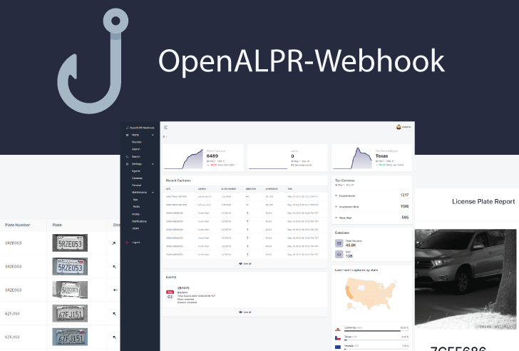
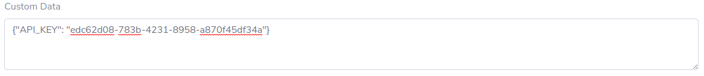

OpenALPR-Webhook is a self-hosted web application that accepts [Rekor Scout™](https://cloud.openalpr.com/) POST data allowing longer data retention.
It was designed with an emphasis on security to meet organization/business needs.

- 👉 Simple clean dashboard with statistics
- 👉 Custom unlimited alerts
- 👉 Notifications via email or SMS (Twilio)
- 👉 Customize report branding
- 👉 User management and roles
- 👉 Forced camera focus (Dahua IPCs)
- 👉 IPBan (fail2ban for Flask) with [IPAbuseDB.com](https://ipabusedb.com) integration
- 👉 Webhook endpoint security

# ❗ This project is still in pre-release.

# 🐛 Known Bugs
- ~~Worker management needs reimplementation~~
  - ~~Currently working on this~~
- Manually requeuing jobs fail
- ~~Searching plates will only work if pagination position is on page 1~~
  - ~~This is a grid.js issue [#1314](https://github.com/grid-js/gridjs/issues/1314) [#1344](https://github.com/grid-js/gridjs/pull/1334) [#1311](https://github.com/grid-js/gridjs/issues/1311).~~

# ✨ Upcoming Features
- Integrate [Apprise](https://github.com/caronc/apprise)
- Add something similar to [DahuaSunriseSunset](https://github.com/bp2008/DahuaSunriseSunset)
- Enhance search functionality
  - Add 
    - Direction
    - Color
    - From/To Date
    - Camera
    - Location
    - License Plate Region
- Improve user management
  - Add a password reset form for admins
  - Add email notifications for new users
- Beautify email notifications with HTML
  - View alerts publicly without authentication using a secure expirable routing method.
- Ability for admins to
  - Export databases 
  - Export/import settings
- Add audit logs for each action
- Add support for 2FA/MFA

# Development
- Run/Debug Configuration
Install Redis server and start it. 
Additionally, you can set Redis server to start automatically. See the Bare Server section  
  - OpenALPR-Webhook
    - Set the Script path to `<OpenALPR-Webhook>/app.py`
    - Parameters should be set to `--host=0.0.0.0 --port=8080`
    - Add `DEBUG=True` into Environment variables
    - Set the Working directory to `<OpenALPR-Webhook>`
  - Redis Worker Server
    - Add a new Run/Debug Configuration named "Worker Manager Server"
    - Set the Script path to `<OpenALPR-Webhook>/apps/workers.py`
    - Set the Working directory to `<OpenALPR-Webhook>/apps`

# Installation

### Docker
TBD

### Bare Server
1. apt install build-essential python3 python3-dev redis-server && systemctl enable redis-server && systemctl start redis-server
2. git https://github.com/mibs510/OpenALPR-Webhook
3. cd OpenALPR-Webhook
4. pip3 install -r requirements.txt
5. ./venv/bin/activate
6. ./app.py --host=0.0.0.0 --port=8080

#### Linux systemd service
You will want to create a service file to automatically start OpenALPR-Webhook upon each reboot.

`sudo nano /etc/systemd/system/oalpr-wh.service`

`
[Unit]
Description=OpenALPR-Webhook
After=network.target

[Service]
User=user
WorkingDirectory=/home/user/OpenALPR-Webhook
ExecStart=/home/user/OpenALPR-Webhook/app.py --host=0.0.0.0 --port=8080
Restart=always

[Install]
WantedBy=multi-user.target
`

Be sure to modify `User`, `WorkingDirectory`, and `ExecStart`
 
Then execute:
 
`sudo systemctl daemon-reload`
`sudo systemctl enable oalpr-wh`
`sudo systemctl start oalpr-wh`

### New Instance
Head over to the URL of your server. You will be required to login. Click 'register' to create a super admin account.
 
After creating a super admin account, the register link will throw an 'Access Denied' as a protective measure against unauthorized account creation.
 
Accounts will need to be created manually by an administrator under Settings/Users.

# Documentation
### Dashboard
___
The dashboard displays some simple statistics, recent alerts, and license plate captures.
### Alerts/Custom Alerts
___
Under Alerts/Custom Alerts, users can view alerts handled by OpenALPR-Webhook.
Each user, including administrators and the super administrator, can only view their own custom alerts.
Administrators and the super administrator can add other users as additional contacts to be notified when a match occurs.

#### Print
Users can print a report by clicking on the print icon on the upper right hand corner.
Printing also allows the report to be saved as a PDF.

#### Add a custom alert
To add a custom alert, go to Search->License Plates, click on the record, and then click on bell icon

#### Region Match
Users have the ability to enable Match Region while adding a custom alert in Search->License Plates or  
Enabling this will tell OpenALPR-Webhook to require a region match of the
license plate for it to send a notification. The non-matched record will still appear in the Past History section under
Alerts/Custom Alerts or Search/License Plates.
### Alerts/Rekor™ Scout
___
Rekor™ Scout alerts arrive from Rekor as alerts. You cannot modify the alert in OpenALPR-Webhook, to modify these alerts, 
### Search
___
Note: The Vehicle Information section for each report contains specifications of the type of vehicle that includes make, model, year, and body type.
OpenALPR-Webhook does not generate this data. This data is generated by Rekor Watchman Agent.
#### License Plates
View and search license plates grouped with vehicle details.
###### API_KEY
This field displays the last four characters of the API key that was used to submit this record.
This is useful for administrators to perform a reverse search of the user that is responsible for Rekor POSTing data.

#### Vehicles
View and search vehicles that did not have a license plate detected.
___
### Settings/Agents
___
> Available to administrators only.
> 
Edit agent connection details here. These settings allow OpenALPR-Webhook to download high resolution images directly from the agent.
Users are not allowed to delete or add agents manually. Agents are registered as new agents are discovered by OpenALPR-Webhook.
Administrators can enable them after being registered for OpenALPR-Webhook to utilize. 
### Settings/Cameras
___
> Available to administrators only.
> 
Similar to Settings/Agents. This section allows to specify connection details for each camera.
These settings are used to forcefully focus and zoom a camera at a specified interval.
### Settings/General
___
> Available to administrators only.
> 
#### Report Settings
These settings are used to rebrand generated reports using the print function.
#### IPBan Settings
An extended addon for 
#### POST Auth Settings
###### Disable POST
Suspend all POSTing to OpenALPR-Webhook.
###### No Authorization Required
Highly unrecommended. This allows anyone (or thing) to POST data into OpenALPR-Webhook. This is a security issue as it
allows untrusted data into OpenALPR-Webhook.
###### Users & Admin API Tokens
The second-best option. This allows every user to POST data into OpenALPR-Webhook.
###### Admin API Tokens
The default option. Only data from Rekor that contains an admin's `API_KEY` is allowed to POST.
#### General Settings
###### Public URL
Specify the public URL used to access OpenALPR-Webhook.
Although not used by OpenALPR-Webhook at the moment, certain features that are yet to be implemented will require a valid URL.
### Settings/Maintenance/App
___
> Available to administrators only.
> 
#### Worker Manager Server
The Worker Manager Server is responsible for spawning and terminating Redis workers as needed. One worker is spawned for every agent and camera that is enabled. This allows OpenALPR-Webhook to scale as needed without interruptions.
Because Redis forks workers on the process level, the Worker Manager Server only runs on *nix systems.

##### Restart
Restart the server when experiencing issues with worker allocation. This will not restart the webserver.

##### Shutdown
Shutting down the server is essential when performing a soft restart on the webserver. This makes sure that no worker turns to a zombie.

These actions are not needed when performing a system reboot.
### Settings/Maintenance/Redis
___
> Available to administrators only.
> 
A front end to Redis server(s). This was made possible with [rq-dashboard](https://github.com/Parallels/rq-dashboard).
For each agent enabled, a worker is spawned and listens on the default queue.
Unlike for agents, a worker is spawned for each enabled camera and listens to a queue named the ID of the camera.
#### Queues
View a list of queues with job status
#### Jobs
View a list of jobs.
Note: It is advisable that no job, other than those of type `download_plate_image()`, be re-queued.
#### Workers
View a list of workers, the current job, and its associated queues
### Settings/Profile
___
Users can edit basic information about themselves such as name, website, email address, phone number, time zone, etc.
  
Each user has a unique `API_KEY`. The `API_KEY` key used to authorize Rekor Scout to POST data onto the webhook endpoint.
  
Administrators can set a global setting to limit which `API_KEY`'s can POST data. Refer to Settings/General.
  
To begin receiving data into OpenALPR-Webhook, copy your `API_KEY` into [Rekor Scout](cloud.openalpr.com) > Configuration > WebHooks Configuration > Add New Webhook > Custom Data
 
`API_KEY: vvvvvvvv-wwww-xxxx-yyyy-zzzzzzzzzzzz`
 
Be sure to fill in all other fields such as Destination URL, Description, check Send All Plate Reads, Send Matching Alerts, and Send Reads missing plate.

### Settings/Notifications
___
> Available to administrators only.
> 
Specify notification settings for Twilio and SMTP. Valid SMTP settings are required to reset user passwords in Settings/Users.
### Settings/Users
___
> Available to administrators only.
> 
Administrators can create users, edit users, change user roles, and suspend user accounts.
 
Once an account has been created, it cannot be deleted. This is to preserve accounts and their API tokens for audit
purposes (a feature yet to be implemented).

#### Edit User
###### Status
The super administrator account cannot be suspended.

###### Administrator
The super administrator account cannot be demoted.

###### Reset Password
A valid SMTP server is required to reset passwords. A new generated password will be emailed to the user.

#### Create/Add User
Click on the 'User+' icon located in  upper right-hand corner to add a user.
