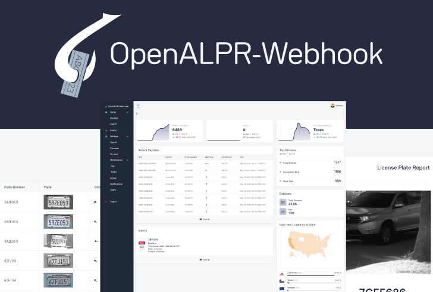

OpenALPR-Webhook is a self-hosted web application that accepts [Rekor Scout™](https://cloud.openalpr.com/) POST data allowing longer data retention.
It was designed with an emphasis on security to meet organization/business needs.

- 👉 Simple clean dashboard with statistics
- 👉 Custom unlimited alerts
- 👉 Notifications via email or SMS (Twilio)
- 👉 Customize report branding
- 👉 User management and roles
- 👉 Forced camera focus (Dahua IPCs)
- 👉 IPBan (fail2ban for Flask) with [IPAbuseDB.com](https://ipabusedb.com) integration
- 👉 Webhook endpoint security

# 🐛 Known Bugs
- Manually requeuing jobs fail
- ~~Searching plates will only work if pagination position is on page 1~~
  - ~~This is a grid.js issue [#1314](https://github.com/grid-js/gridjs/issues/1314) [#1344](https://github.com/grid-js/gridjs/pull/1334) [#1311](https://github.com/grid-js/gridjs/issues/1311).~~

# ✨ Upcoming Features
- Integrate [Apprise](https://github.com/caronc/apprise)
- Enhance search functionality
  - Add 
    - Direction
    - Color
    - From/To Date
    - Camera
    - Location
    - License Plate Region
- Improve user management
  - Add a password reset form for admins
  - Add email notifications for new users
- Beautify email notifications with HTML
  - View alerts publicly without authentication using a secure expirable routing method.
- Ability for admins to
  - Export databases 
  - Export/import settings
- Add audit logs for each action
- Add support for 2FA/MFA

# Installation

### Docker
TBD

### Bare Server
1. apt-install python3.10 redis-server && systemctl enable redis-server && systemctl start redis-server
2. git https://github.com/mibs510/OpenALPR-Webhook
3. cd OpenALPR-Webhook
4. pip3 install -r requirements.txt
5. ./venv/Scripts/activate
6. ./app.py --host=0.0.0.0 --port=8080

### New Instance
Head over to the URL of your server. You will be required to login. Click on 'register' to create a super admin account.
 
After creating a super admin account, the register link will disappear as a protective measure against unauthorized account creation.
 
Accounts will need to be created manually by an administrator under Settings/Users 

# Documentation
### Dashboard
___

### Alerts/Blacklist
___
### Alerts/Search
___
### Search
___
### Settings/Agents
___
> Available to administrators only.
> 
### Settings/Cameras
___
> Available to administrators only.
> 
### Settings/General
___
> Available to administrators only.
> 
Disable uuid_img download (pulls from agent if available real-time when viewing/printing reports)
### Settings/Maintenance/App
___
Reinitiate cache
 
Redownload all missing uuid_imgs to db/locally
 
Trim database to keep X months of plates
 
Trim database to keep x months of high-res/uuid_imgs
 
Remove all high-res/uuid_imgs from db
> Available to administrators only.
> 
### Settings/Maintenance/Redis
___
> Available to administrators only.
> 
### Settings/Profile
___
Users can edit basic information about themselves such as name, website, email address, phone number, time zone, etc.
 
Each user has a unique `API_KEY`. The `API_KEY` key used to authorize Rekor Scout to POST data onto the webhook endpoint.
 
Administrators can set a global setting to limit which `API_KEY`'s can POST data. Refer to Settings/General.
To begin receiving data into OpenALPR-Webhook, copy your `API_KEY` into [Rekor Scout](cloud.openalpr.com) > Configuration > WebHooks Configuration > Add New Webhook > Custom Data
 
`API_KEY: vvvvvvvv-wwww-xxxx-yyyy-zzzzzzzzzzzz`
 
Be sure to fill in all other fields such as Destination URL, Description, check Send All Plate Reads, check Send Matching Alerts, and check Send Reads missing plate.

### Settings/Notifications
___
> Available to administrators only.
> 
### Settings/Users
___
> Available to administrators only.
> 
Administrators can create users, edit users, change user roles, and suspend user accounts.
 
Once an account has been created, it cannot be deleted. This is to preserve accounts and their API tokens for audit
purposes.